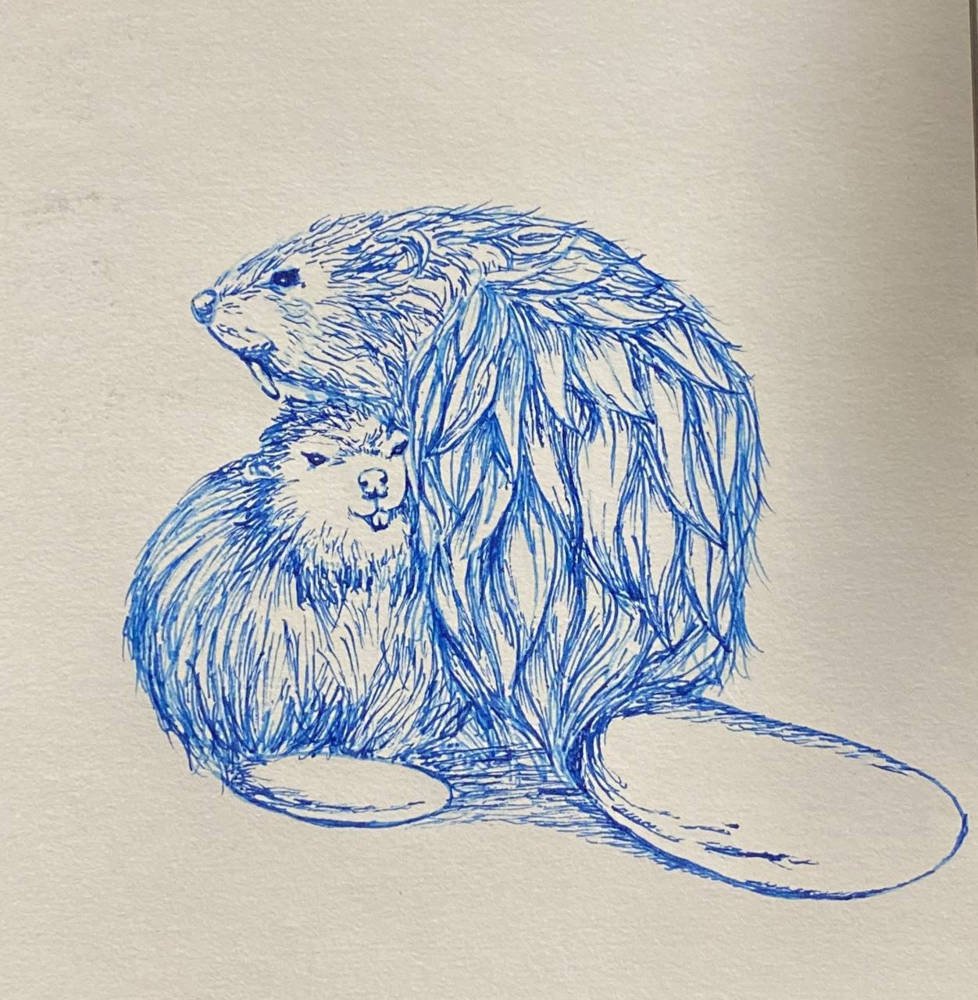

# Ink drawings

<table data-card-size="large" data-view="cards"><thead><tr><th data-type="content-ref"></th><th></th><th data-hidden data-card-cover data-type="files"></th></tr></thead><tbody><tr><td><a href="https://github.com/hku-mars/FAST_LIO">https://github.com/hku-mars/FAST_LIO</a></td><td>The dream of FAST-LIO</td><td><a href=".gitbook/assets/photo1696867749(1).jpeg">photo1696867749(1).jpeg</a></td></tr><tr><td></td><td>The MokaBot</td><td><a href=".gitbook/assets/photo1696867749.jpeg">photo1696867749.jpeg</a></td></tr></tbody></table>

<table data-view="cards"><thead><tr><th></th><th></th><th></th></tr></thead><tbody><tr><td></td><td></td><td></td></tr><tr><td></td><td></td><td></td></tr><tr><td></td><td></td><td></td></tr><tr><td></td><td></td><td></td></tr><tr><td></td><td></td><td></td></tr><tr><td></td><td></td><td></td></tr></tbody></table>

<figure><figcaption>
Hong Kong
</figcaption></figure>
