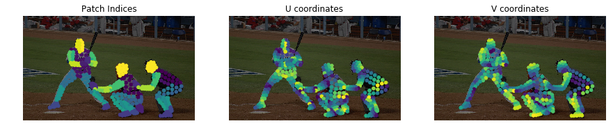

# DensePose Implementation

Title: DensePose: Dense Human Pose Estimation In TheWild\
Authors: Rıza Alp Guler, Natalia Neverova, Iasonas Kokkinos\
Link: [https://arxiv.org/pdf/1802.00434.pdf](https://arxiv.org/pdf/1802.00434.pdf)\
Code: \[[python2](https://github.com/facebookresearch/DensePose)] \[[python3](https://github.com/facebookresearch/detectron2/tree/main/projects/DensePose)]\
The python2 version is simpler and contains the jupyter notebook code for visualization, which can also be directly used for testing, but it is no longer maintained, the python3 version has been integrated in Facebook's own detectron project.\
Official website:\
The authors propose a new dataset for the human pose estimation problem: DensePoseCOCO, and a model structure DensePoseRCNN.

## Task Background

### SMPL Model

SMPL is a human parametric model that controls the position of the human model point cloud (6890 points) by a set of vectors. It contains 75 $$\theta$$ parameters and 10 $$\beta$$ parameters, which are obtained based on the PCA principle, each position has no 3D spatial meaning. The mapping process from parameters to point clouds is a linear process (i.e., parameters $$\times$$ matrix = point cloud), where $$\theta$$ parameters are used to control the pose and $$\beta$$ parameters are used to control the body figure. The two sets of parameters are independent of each other. See also: \[[SMPL official website](https://smpl.is.tue.mpg.de/)], \[[SMPL paper](https://files.is.tue.mpg.de/black/papers/SMPL2015.pdf)].

### IUV Map

The IUV map is a two-dimensional unfolding map of the SMPL model. As the SMPL model is a three-dimensional point cloud, which is tedious to deal with, the model can be face-sliced and unfolded, and the various regions of the original 3D model are placed at different locations on a plane to get a map that spreads over the human body surface. There are some specific mapping relationships between the IUV map and SMPL. In other words, a valid point on the IUV map corresponds to a point on the SMPL model. Each valid point on the IUV map contains three values, $$i$$ represents represents the segmentation map for the 24 human parts(head, arm, etc) + 1 background the point belongs to, while $$u$$ and $$v$$ represent the coordinates of the point.

<figure><figcaption>
left: SMPL model, right: IUV diagram
</figcaption></figure>

### Mask-RCNN and Feature Pyramid Netwok

RCNN (Region with CNN features) is a landmark work in the field of object detection in 2014, which uses the Region Proposal method to implement the target detection problem, including the process of acquiring input images, extracting candidate regions, extracting features from candidate regions, and discriminating candidate regions using SVM, etc. Subsequent works such as FastRCNN, FasterRCNN, MaskRCNN, etc. improve on this work. FasterRCNN, MaskRCNN and other works do improvement on this basis.

In target detection and semantic segmentation tasks, the performance of small objects is often affected by the layer-by-layer reduction of feature maps. FPN ([Feature Pyramid Network](https://arxiv.org/abs/1612.03144)) feature pyramid networks can improve the prediction performance of small objects by using feature maps at multiple scales from large to small, in addition to using multi-scale feature map fusion.

DensePose proposes the network structure of DensePose-RCNN by following the set of target detection in the network structure and making personalized modifications for the data type of IUV.

### The Task of DensePose

The task DensePose is human pose estimation. Nowadays, human pose estimation has become a relatively mature and popular field, and pose estimation is actually the estimation of key points of human body, giving the location coordinates of some specified key points in RGB images. By adding the word dense, it  means to dense the key joint points and find which part of the human body the point belongs to for each point in the human segmentation map.

Dense Pose Estimation is a sub-field of human body resolution. This task is to establish the relationship between the RGB image segmentation map and the parametric human body model, i.e., the estimation process of the mapping from the RGB image to the SMPL model. In other words, for each point of the human body on the RGB image, we have to estimate the corresponding point in the SMPL model. The IUV map acts as an intermediary in this estimation. According to the relationship between the IUV map and SMPL, by predicting the position of each point of the human body in the RGB map onto the IUV map, we can indirectly get the position of the corresponding point in the SMPL model.

## DensePose-COCO Dataset

As the task of DensePose has been identified, a dataset is needed for the training process. The authors propose the DensePose-COCO dataset, which relies on the [COCO dataset](https://cocodataset.org/#home). 50k human bodies were selected and labelled on each human body with points, i.e., establishing the mapping between points in the RGB image of a human body and the points in the IUV map, and more then 5 million manually annotated correspondences were collected.

This [Jupyter Notebook file](https://github.com/facebookresearch/DensePose/blob/main/notebooks/DensePose-COCO-Visualize.ipynb) (in python 2) will facilitate us to understand the DensePose-COCO dataset and the DensePose task in depth.

<figure><figcaption>
Visualization of the surface patch index, and UV coordinates of collected points
</figcaption></figure>

## DensePose Estimation

To implement the estimation process from RGB to IUV, the authors combine the previous work [DenseReg](https://arxiv.org/abs/1612.01202) with [MaskRCNN](https://www.cs.utoronto.ca/\~fidler/teaching/2018/slides/CSC2548/MaskRCNN.pdf) and propose a framework for densepose mapping estimation, DensePose-RCNN.

The authors segmented the body regions of RGB images according to different parts, so that the DensePose estimation task is split into two sub-tasks: (a) classification task: classifying the segmentation area to which a labeled point in the RGB map belongs; and (b) regression task: regressing the coordinates of a labeled point in the RGB map mapped to the region of that part in the IUV map.

The idea is the same as DenseReg, so that the task is naturally divided into two stages: estimating I and estimating UV. The authors describe the two sub-tasks in terms of the following equation:

$$c^* = \textrm{argmax}_{c}P(c|i), [U, V]=R^{c^*}$$

The first part of the equation refers to a classification process: for a point $$i$$ in the RGB image, try to find one of 24+1 segmented regions $$c$$ it belongs to. The region with the largest probability (i.e. with the smallest cross entropy loss), $$c^*$$ will be selected. The second part of the equation refers to a regression process: once the point $$i$$'s relevant region $$c^*$$ is known, a regression network for that specific region can be applied that deals to calculate the coordinates $$[U, V]$$ in the IUV map. The authors have specific regression models for each region (apart from the background), so there are 24 regression models that are responsible for predicting the UV map regression results for the points inside the respective region. $$L_1$$ loss is utilized in the regression process.

In respect of network structure design, the authors adopted the Region-Based approach in the field of object detection and introduced ROI (Region of Intrest) pooling to reduce the complexity of the task, especially the hard learning problem caused by the uncertainty of scale. In addition, the FPN (Feature Pyramid Network) module is introduced to improve the accuracy of spatial regression tasks. And strategies such as pyramid structure design and iterative optimization are incorporated. The authors integrated tasks such as key point prediction and instance segmentation for multi-task learning.

<figure><figcaption>
DensePose-RCNN architecture: the authors used a cascade of region proposal generation and feature pooling, followed by a fully-convolutional network that densely predicts discrete part labels and continuous surface coordinates.
</figcaption></figure>

<figure><figcaption>
Cross-cascading architecture: The output of the RoIAlign module in the previous figure fed into the DensePose network as well as auxiliary networks for other tasks (masks, keypoints). Once first-stage predictions were obtained from all tasks, they were combined and then fed into a second-stage refinement unit of each branch.
</figcaption></figure>

The next problem is the denseness of the prediction result, the labels of DensePose are given as the scattered points, so they are sparse. Therefore, it remains a problem to use the sparse labels to train a model that can estimate the dense prediction graph. The solution given by the authors is by means of knowledge distillation. A teacher network is trained based on the sparse labels( the teacher network can already give the dense prediction result) and use this result from teacher network to fill the surrounding pixels and take it as the true value, then dense labels can be achieved.

<figure><figcaption>
The authors first trained a 'teacher network' with our sparse, manually-collected supervision signal, and then use the network to 'inpaint' a dense supervision signal used to train the region-based system.
</figcaption></figure>

## Detailed structure of DensePose testing process and model

tbc
