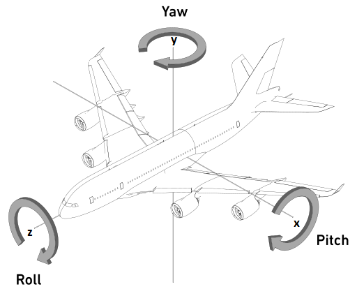

# Gimbal Lock in Dynamic and Static Euler Angle Perspective

credit: [Zilize's post](https://zhuanlan.zhihu.com/p/474447990)&#x20;

Recently, I have been studying Euler angles and quaternions, and the material I have studied generally mentions the gimbal lock problem when representing the rotation of an object by Euler angles, which can be avoided by using quaternions.

The problem is usually demonstrated dynamically with gyroscopes. The usual way of demonstrating this is to start with the three gimbals carrying the object perpendicular to each other, forming a 3d Cartesian system. The outermost gimbal is chosen randomly and then the middle gimbal is rotated by 90 degrees (either clockwise or anticlockwise). This means that the inner and outer gimbals will have an equivalent rotational effect on the object.

<figure><figcaption>
Gimbal lock demonstration from Wikipedia
</figcaption></figure>


Gimal lock explained with Euler rotation


The learning material then generally gives a mathematical explanation by multiplying the rotation matrices around the $$x$$, $$y$$ and $$z$$ axes to obtain a rotation matrix and then simplifying it using the property that the rotation angle of the middle matrix is 90 degrees, to find that the angles of the left and right matrices are completely combined in one term. The learning material then concludes that the degrees of freedom of the system are lost.

However, a closer look reveals a problem: The key point of the gyroscope animation demonstration is that two planes (corresponding to the two axes) end up aligning with each other, resulting in a reduction in degrees of freedom. Meanwhile, the rotation matrix is derived using perfectly constant axes, how comes the aligning?

In fact, two ways of understanding Euler angles are involved here, namely static and dynamic Euler angles. Many materials on the web ignore this discrepancy and use expressions based on static Euler angles to explain the Gimbal Lock phenomenon displayed under dynamic Euler angles, leading to difficulties in understanding them.

## Degree of freedom

Degree of freedom refers to the number of variables whose values are not restricted when calculating a particular statistic. For example:

* A mass point has a degree of freedom of 3 because it is free to change all three coordinates in three dimensions.
* A system of two non-interfering mass points has a degree of freedom of 6.\
  If a constraint is added that requires the distance between the two mass points to be constant, then the degree of freedom becomes 5, as only the position of one of the masses and the azimuth (latitude and longitude) of the other mass relative to it is required. The degree of freedom is then 3 + 2.
* The degree of freedom of the ideal rigid body is 6. Determining the position of the center of mass of the rigid body needs 3 degrees of freedom, and determining the angle of rotation of the object needs 3 degrees of freedom.

So what is the difference between an ideal rigid body and an isometric two-mass point, and why does the former require three variables to determine the angle of rotation, while the latter requires only two? We note that the masses have no size, so in an "equidistant two masses" system, rotation about the line joining the two has no effect on the state of the system; but in an ideal rigid body system, rotation about the axis joining the two masses causes a change in the position of other masses not on that line. This is the lost degree of freedom of the "equidistant two masses" system.

In computer graphics, we perform a view transform to place the camera to a standard position. Six constraints in such operation reflect the nature of the camera as an ideal rigid body (albeit the camera is treated as a pinhole model):

* Firstly, three degrees of freedom are used to place the camera to the original point.
* Second, two degrees of freedom (referencing latitude and longitude)are used to orient the camera facing the negative side of $$z$$-axis.
* Finally, one degree of freedom is used to get the camera heading up

As we can appreciate from the above example, a few simple constraints can reduce the system's degree of freedom. For example, the equation $$x + y = 10$$ allows two variables that would otherwise be free to be determined by the value of only one variable ($$x = 10- y$$ or $$y = 10 - x$$ ). The concept of 'constraints affecting degrees of freedom' will help us to understand the gimbal lock problem.

## Euler angles

Once an ideal rigid body's position of the center of mass has been determined, there are three degrees of freedom left. This means that we can use three angles to determine the rotational orientation of the object, one way of doing this is the Euler angle. There are two ways of defining the Eulerian angle.

We always describe orientation by "rotation about a coordinate axis", so we can build our description of rotation based on a standard 3d Cartesian system.

On the one hand, this coordinate system can be stationary (fixed globally) as an inertial reference system. It could perhaps be called world coordinate system (WCS). The Euler angles defined in this frame are called static Euler angles.

On the other hand, this coordinate system may be fixed to an object, and when the object rotates, it rotates with it. The Eulerian angle defined in this frame is called the dynamic Eulerian angle. The gyroscope demonstrated in the video above is based on a dynamic Eulerian angle, where the outer ring rotates as the inner ring rotates. However, as the inner ring rotates, the outer ring remains stationary, which is a slight difference from what we call the 'axis fixed to the object', but as we are rotating from the outside inward, the difference does not affect the understanding of the problem.

The following rotation equations are introduced:$$\begin{eqnarray} R_x(p)&=&  \begin{bmatrix}    1 &  0  & 0 \\    0 & \cos p &  - \sin p \\    0 & \sin p & \cos p \end{bmatrix}   R_y(y)&=&  \begin{bmatrix}    \cos y &  0  & \sin y \\    0 & 1 &  0 \\    - \sin h & 0 & \cos h \end{bmatrix}  R_z(r)&=&  \begin{bmatrix}    \cos r &  - \sin r  & 0 \\    \sin r & \cos r &  0 \\    0 & 0 & 1 \end{bmatrix} \end{eqnarray}$$The angles here use the notation labelled in the diagram below to make it easier to relate them to the subsequent derivations. The derivation of the matrices is all based on the stationary world axis, around which the angles are also based.

<figure><figcaption>
(static) Euler angle demonstration
</figcaption></figure>

Thus when the three matrices are acted upon (left multiplied) in some order (because the final rotation result is related to the order, which is mathematically reflected in the fact that the matrices do not satisfy the exchange law) in turn by some orientation vector, they are all acted upon in turn by the world coordinates, so that the whole process can be considered to be based on a static definition of Euler angles.

## Dynamic Euler angular perspective

It is convenient to describe the problem in terms of a coordinate system that rotates with the object. As shown in the image above, we take the order $$y$$, $$x$$, $$z$$ and rotate around the axes in turn.

* First rotate around the $$y$$-axis by an arbitrary angle, which can be thought of as taking a turn.
* Then we rotate around the $$x$$-axis by 90 degrees or -90 degrees, then the airplane will be flying vertically.
* At this point the $$z$$-axis coincides with the initial y axis

At this point, one degree of freedom has been lost. This view of the rotation of the object is very easy to imagine, but it is more difficult to express mathematically because the axis of rotation is variable.

## Static Euler angle perspective

As the axes are static, we can derive the whole process directly using the rotation matrices mentioned above. Again rotating around the axes in order of $$y$$, $$x$$, $$z$$, we obtain the combination of the three matrices. Just as the above, we take the middle rotation to be 90 degrees or -90 degrees, with $$\cos p = 0$$  and $$\sin p = \pm 1$$, substituting the above equation:

$$\begin{eqnarray}  R_{zxy} &=&  \begin{bmatrix}     \cos r \cos h \mp \sin r \sin h &  0  & \cos r \sin h \pm \sin r \cos h \\     \sin r \cos h \pm \cos r \sin h & 0 &  \sin r \sin h \mp \cos r \cos h \\     0 & \pm 1 & 0 \end{bmatrix} \\ &=& \begin{bmatrix}     \cos (r \pm h ) &  0  & \sin (h \pm r) \\     \sin(r \pm h) & 0 &  - \cos(r + h) \textrm{ or } \cos (r-h) \\     0 & \pm 1 & 0 \end{bmatrix}  \end{eqnarray}$$

After simplification it can be seen that row and yaw exist either as $$r+y$$ or as $$\pm (r-y)$$. This shows that the actions imposed by the foremost and last matrices are equivalent to rotation based on a single axis.

The mathematical derivation here does not explain the phenomenon in the dynamic Euler angle perspective, since there is no overlap of axes and the matrix form does not apply to the dynamic axes.

This part of the mathematical derivation has its own way of explaining the motion of the object, and we will still use the plane diagram to describe the motion.

* First, the plane is rotated by an arbitrary angle around the y-axis, noting that the co-ordinate axes do not change
* The top and bottom surfaces of the plane are then parallel to the y-axis, but the head of the plane can be at any angle to the origin in the xz-plane. -- Note: In dynamic axes, this step will only result in the top and bottom surfaces of the aircraft being parallel to the y-axis, but the nose of the aircraft being aligned with the x-axis.
* Finally rotating around the z-axis, this does not appear to coincide with the axes in the dynamic view, but rather the aircraft is able to rotate around the axis past itself (i.e. the z-axis), adjusting itself to become all directions.

