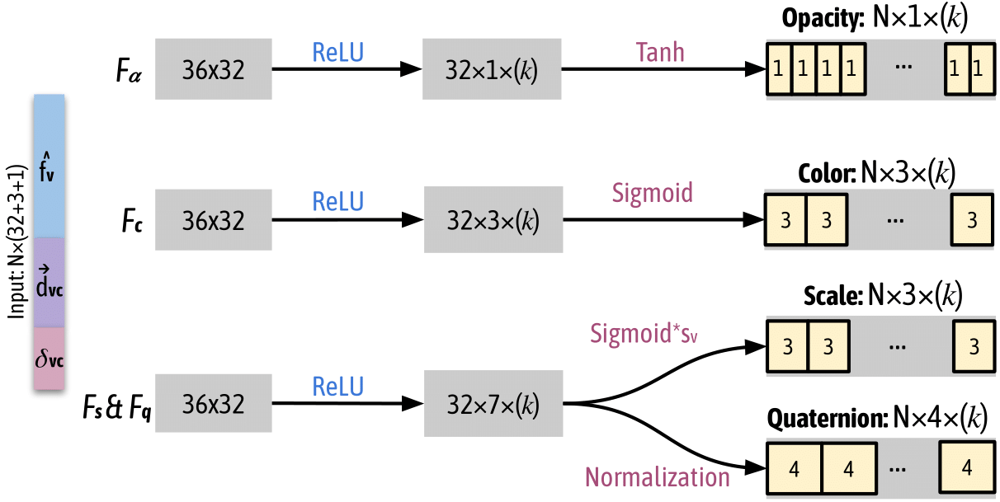
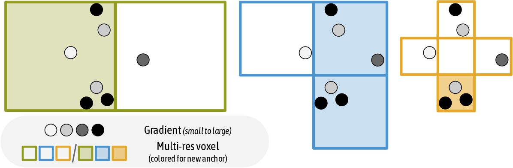

# Main ideas of Scaffold-GS

## Motivation

### Structural

The unstructured primitives for a large scene has a material storage cost. We can use mesh or KNN method to organize the Gaussians in a more effective way. However, organizing Gaussians in such a way is still expensive to create. So the authors considered if there can be a easier method to manage the Gaussians. Therefore, they introduced a sparse voxel way to organize the Gaussians effectively, leading it easier to interact the Gaussians after the reconstruction.

<figure><figcaption></figcaption></figure>

### Compression

At the same time, we find the Gaussians have good self-adaption based on views via spherical harmonics(SH). But the SH cannot solve all the view-dependent problems,: When we look the same position from different views, the Gaussians tend to split into different clusters of Gaussians to represent the same view to handle the multi-view inconsistency. This results the redundancy of Gaussians locally, and causing the final ply file very large.

<figure><figcaption></figcaption></figure>

To improve this, we need to consider the information is indeed quite limited inside a local scene, so we do not need so many redundant Gaussians. Therefore, is it possible to compress the local redundancy into a latent feature space? If we can do so, we can have a more compact representation of the scene. This is makes a implicit representation locally.

### View-based self-adaptation primitives

At the same time, the authors realized that after the training, the Gaussians' primitives are static. The colors and covariances are fixed (except works like [mip-splatting](https://niujinshuchong.github.io/mip-splatting/)). This makes the Gaussians difficult to have a better view-based self-adaptation. To improve this, the authors think if the primitives of the Gaussians can be generated in real-time during rendering.

<figure><figcaption></figcaption></figure>

## Method

### Pipeline

Based on the motivations, the authors designed [Scaffold-GS](https://city-super.github.io/scaffold-gs/). Scaffold-gs is a two-layer representation of the scene: the first layer is the anchor, and the second layer is 3D Gaussians.

<figure><figcaption></figcaption></figure>

The first step is to voxelize the point cloud from SfM, to convert the scene into a sparse voxel data structure. Specifically, $$V=\left\{ \frac{P}{\epsilon}  \right\} \cdot \epsilon$$, where $$V$$ denotes voxel centers, and $$\epsilon$$ is the voxel size. The voxelization is very fast.

Then we allocate each voxel an anchor point, which mainly contains several items:

1. A latent feature: $$f_v \in \R^{32}$$, representing the coded local color/texture information.\
   To handle the multi-resolution, the authors created a feature bank using $$f_v \in \R^{32}$$. \
   Apart from $$f_v$$, they also get $$f_{v_1} \in \R^{16}$$ which are the every second dimension of $$f_v \in \R^{16}$$ and $$f_{v_2} \in \R^{8}$$ which are the every fourth dimension of $$f_v$$. And the final $$\hat{{f_v}}$$ is a weighted average of $$f_v, f_{v_1}$$and $$f_{v_2}$$.
2. A scale factor $$l_v \in R^3$$ to decide where to place the Gaussians.
3. Bonding to several neural Gaussians: $$k$$ translations $$O_v \in \R^{k \times 3}$$ to control the places of the Gaussians.

\
The reason to call them neural Gaussians is, the primitive of the Gaussians are decoded from an MLP.

<figure><figcaption></figcaption></figure>

The input of the MLP contains the latent feature of the anchor, relative viewing direction and the distance from the camera to the anchor. The output is the properties of the Gaussians, including opacity, color, scale and rotation.

As each anchor is bonded with $$k$$ neural Gaussians, but the rendering may not need all the $$k$$ Gaussians for all views. So they designed a Gaussian filtering process. Note that the activation function of the opacity is tanh, whose benefit is its range is between $$[-1, 1]$$. So we can directly filter out all the neural Gaussians whose opacity less than 0.

After the filtering the Gaussians, we can just do rendering and training.

The representation of the 3D Gaussian globally is explicit, as each anchor point has a postion information. But locally speaking, the anchors are implicit, as each Gaussian is decoded from a featur vector through an MLP.

### Anchor control

The anchors were initialized from the SfM points (also possible from random sampling), so there will be some bias. For example, the point from SfM may contain very few point in less-texture area, as there will be very less matching points and it will results in some hollows in the final 3D reconstruction.

The original 3D Gaussian tried to handle this by cloning and spliting Gaussians to grow the new Gaussians. As Scaffold-GS is an anchor-based method, the authors also designed a growing strategy for anchors.

<figure><figcaption></figcaption></figure>

At the beginning, a very large voxel size is used to group the Gaussians. For all Gaussians inside a single voxel, the accumulated gradient of all Gaussians are added up. In the image, each ball represents a neural Gaussian here and the garyscale represents the gradient. If the total gradient inside a voxel is above a threshold, then a new anchor point is added inside that voxel.

To adapt different texture level in different scenes, the voxel size is then decreased and do the same to grow anchors. A detail to emphasize here: the geometry accuracy requirements is higher when the voxel size is smaller and some higher frequency information is introduced. If we do not have a high confidence for the high frequency information, they will indeed become noise instead of information gain. Therefore, the thresholds to increase an anchor is also increased exponentially, making it really difficult to add a new anchor when the voxel is fine-grained.

<figure><figcaption></figcaption></figure>

All anchors were initialized in the bounding box and they grow gradually, finally covering all the scene.

### Results

This is a scene from Google map. We can see that Scaffold-GS converge faster than 3D GS. Also, because the latent feature is introduced to compress the local information, the number of primitives will be less than 3DGS without loss of rendering quality.



The faster convergance can be explained by at least two reasons:&#x20;

1\. the MLPs are globally shared by the Gaussians in the scale of the anchor. So during the training of each Gaussian, all the gradients will be gathered to the MLP, which is faster than training each individual Gaussian seperately in 3DGS.&#x20;

2\. The positions of the anchors are fixed so the geometry structure of the scene is more stable. The original configuration of 3DGS has a very low learning rate. If it is increase a bit, the training becomes difficult to converge because of the geometry structure.



We can see there are some flicking places in the 3D-GS depth rendering while it is quite stable in Scaffold-GS.



## Analysis via Clustering features

To analyze the features of the MLPs, they are clustered via self-supervised training. We can see the anchors represent the geometry structure of the scene. Though the representation of the MLP seems to be implicit but it also matches the color information in the scene, as the parts with darker colors are clustered in the same category.

<figure><figcaption></figcaption></figure>

## Limitation

When zooming-out the view in very large scale scene, Scaffold-GS fails to keep consistent rendering speed. This was handled in a follow-up work, [Octree-GS](https://city-super.github.io/octree-gs/).
