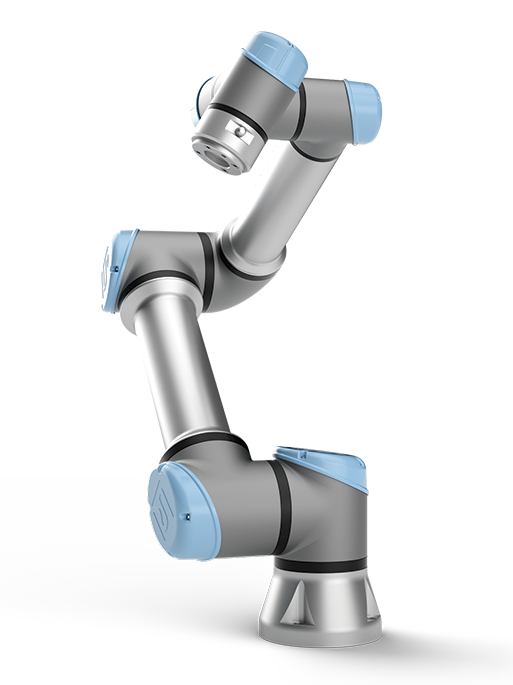
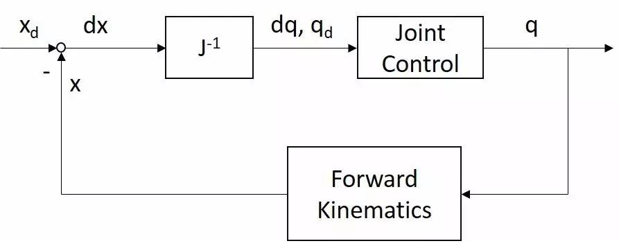
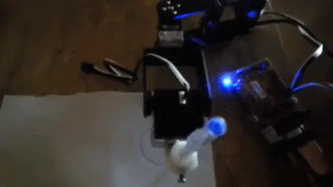
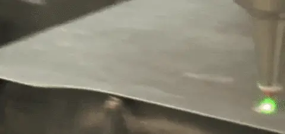

# Why do we need dynamics when kinematics seems to suffice?

Let's take a look at a real-life robot, and for aesthetic purposes, UR5e is selected:

<figure><figcaption>
UR5e
</figcaption></figure>

As  the figure above, UR5 has six R (rotational) joints, two at the base, one at the elbow, and three at the wrist. Now you are given this robot and asked to write a program to accomplish two tasks: one is to **pick up an object located at point A and move it to point B**; the other is to **draw a circle in the air at a certain speed**. Assuming you can read and accurately control the position of each joint, what should you do?

The first thing we need to do is to determine the joint zero positions and find the positive kinematic solution. Why? Because this is the first step you take to digitize and program the robotic arm. We can use the D-H methods for this step(See [comparison-of-standard-and-modified-d-h-methods.md](comparison-of-standard-and-modified-d-h-methods.md "mention")). Anyway, after a series of steps to exercise your mind's spatial thinking skills, such as determining the origin, determining the Z-axis, determining the X-axis, etc., you will get a joint coordinate system similar to the one shown below. (hint: RGB/red-green-blue corresponds to XYZ).

<figure><figcaption>
zero positions of UR5
</figcaption></figure>

If you remember the definition of the joint angle $$\theta$$ in the DH parameter definition, when $$\theta = 0$$, the X-axis of one joint should be parallel to the X-axis of the previous joint - and that's exactly what happened in the figure above. Like here:

* link length $$a_{i}$$: distance of $$(z_{i-1}, z_i)$$ along $$x_{i-1}$$.
* link twist $$\alpha_{i-1}$$: angle of  $$(z_{i-1}, z_i)$$ about$$x_{i-1}$$.
* link offset $$d_i$$: distance of $$(x_{i-1}, x_i)$$ along $$z_i$$.
*   joint angle $$\theta_i$$: angle of $$(x_{i-1}, x_i)$$ about $$z_i$$.

    <figure><figcaption>
We can also mark some of the parameters on the schematic of the structure of the robotic arm
</figcaption></figure>

Finally a table of DH parameters can be obtained:

<table><thead><tr><th width="82">i</th><th>α_{i-1}\</th><th>a_{i-1}</th><th>d_i</th><th>θ_i</th></tr></thead><tbody><tr><td>1</td><td>π/2</td><td>0</td><td>0.1652</td><td>θ_1</td></tr><tr><td>2</td><td>0</td><td>-0.425</td><td>0</td><td>θ_2</td></tr><tr><td>3</td><td>0</td><td>-0.3922</td><td>0</td><td>θ_3</td></tr><tr><td>4</td><td>π/2</td><td>0</td><td>0.1333</td><td>θ_4</td></tr><tr><td>5</td><td>-π/2</td><td>0</td><td>0.0997</td><td>θ_5</td></tr><tr><td>6</td><td>0</td><td>0</td><td>0.0996</td><td>θ_6</td></tr></tbody></table>

Where do $$a_{i}$$ and $$d_i$$ come from? Generally speaking, they are parameters recognized during the machine design, and the manufacturer of the arm will tell you these values. Another way is try to measure them on the arm yourself ......

In practice, the manufacturer of the arm will usually give you a complete list of D-H parameters; if not, there are some algorithms to solve the DH parameter list by controlling the joint movement and measuring the end effector's position accurately with an external device. Sometimes, because of the unavoidable errors in the manufacturing process, or the wear and tear of the mechanical structure, the original D-H parameter table may not be accurate enough; Then you can also use a similar method to recalibrate the D-H parameters of the robotic arm. If you are interested in this part, try to search with keywords **Kinematics Model Identification** or **Kinematics Calibration.**

## Moving an object from point A to point B

Now, let's go back to the first task at the beginning: moving an object from point A to point B. For such a task, we just need the arm to be able to get the object at the right position with the appropriate angle when it is at point A, and to drop the object at the right position with the appropriate angle when it is at point B. So, a straightforward way to think about it is:

1. Calculate the inverse kinematic solution of the end effector ideal position at point A and point B. (You can directly use the analytical method, the geometric method, etc.) $$q_a$$, $$q_b$$.&#x20;
2. Find the trajectory of the joints from  $$q_a$$ to $$q_b$$.&#x20;
3. Control the joint to move according to the calculated trajectory,.

Here we briefly talk about Trajectory Generation in the joint space. It is important to note that a trajectory is not just a curve in space, it is a function of the object's position as a function of time, and contains information about the object's position, velocity, acceleration, etc. at each moment.

Assuming that we need to move from point A to point B in time $$t'$$, and the end effector is stationary at both point A and point B, then our trajectory $$q(t)$$ should meet such requirements:

$$q(0)=q_a, q(t')=q_b, q'(0)=0, q'(t')=0$$

This function needs to satisfy the four equations above, then it needs to have at least four unknowns; so the most straightforward idea is to fit it with a third-order polynomial:

$$q(t) = a t^3+b t^2 + c t + d$$

Trajectory generation in joint space is much simpler than trajectory generation in manipulation space, mainly because it makes it easier to avoid problems such as out-of-motion joints or singular states. We will talk more about trajectory generation in the future.

## Drawing a circle in the air at a certain speed

Now let's look at the second task mentioned at the beginning: drawing a circle in the air at a certain speed. The task itself already specifies the trajectory of the end effector, and our task is to control the motion of the joints so that the end effector can follow this trajectory. In this way, it is difficult to take an approach similar to that of the first task.

Since our task is to make the end effector follow a circular trajectory, that means that at every moment you know the end effector attitude xd. As we said, it is not realistic to solve the inverse kinematics directly at every moment - at this point the Jacobian matrix inverse method will help:

<figure><figcaption></figcaption></figure>

This task is a bit more difficult than "Pick and Place", but there are many similar applications in industrial applications such as machining, cutting, painting and so on.

Depending on the task, we need to use different solution methods. The question now is, **what kind of tasks can't be solved by kinematics alone, but require dynamics**?

To answer this question, we first need to clarify what kinetics studies. The kinematics of the robotic arm, the study is the relationship between the joint position or position change and the end-effector position or position change, there is only "motion", does not involve any "power"; it can be imagined that the study of the dynamics of the robotic arm is necessarily related to the "power". The so-called "power" refers to the force or torque that each part of the arm is subjected to. The dynamics of the arm is to study the following questions:

* What kind of internal and external forces/torques are applied to the arm during its motion?
* How do these forces/torques change the motion of the arm?
* What is the relationship between the forces/torques on the joints and the forces/torques on the end-effector?

With the study of forces/torques, our understanding of the robotic arm goes deeper from "how the motion of the joints changes the motion of the end-effector" to "how the forces generated by the actuator change the motion of the joints, and thus change the motion of the end-effector". Therefore, the variable we are trying to control has changed from the position or velocity of the joint to the forces/torques on the joint.

If you have an accurate model of the dynamics, you will be able to accurately control the acceleration of the joints and therefore the acceleration of the end effector. We know that position is the twice integral of acceleration over time, which means that directly controlling the acceleration allows you to do more accurate and faster tracking of the trajectory.

For the second task described above, the requirement that the Jacobi matrix inverse's incremental $$d_x$$ small enough will be violated if circle needs to be drawn very fast. Even ignoring this limitation, the joint position controller, being ignorant of the dynamics of the object it is trying to control, will have a hard time keeping up quickly with the joint trajectories needed for the end effector circular trajectory. The result? The arm may shake a lot, the circle drawn will be smaller and less round than it actually is, or even the end effector may only vibrate in place.

**The introduction of dynamics allows us to follow the desired trajectory faster and more precisely.**

<figure><figcaption>
A robotic arm drawing a circle with only inverse kinematics
</figcaption></figure>

<figure><figcaption>
Industrial-grade robotic arm drawing circles (laser cut) with dynamics
</figcaption></figure>

Finally, we have a task for the end effector: to polish a part - it's not enough to take a file beside the part and move it back and forth. The robot arm should able to control the file to exert some force on the part. Obviously, there are contact forces involved that can't be solved with kinematics alone either. The introduction of dynamics makes it possible to control the forces that the robotic arm interacts with.
